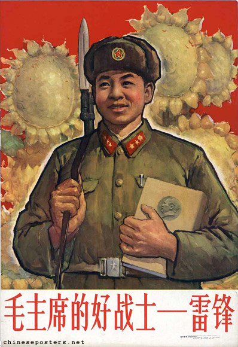
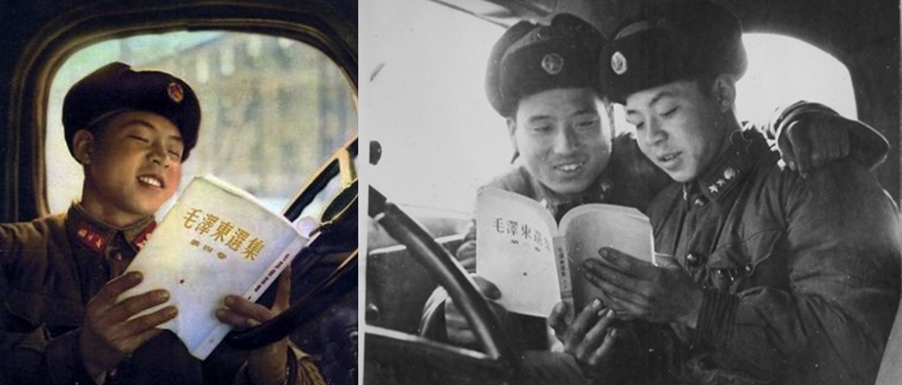
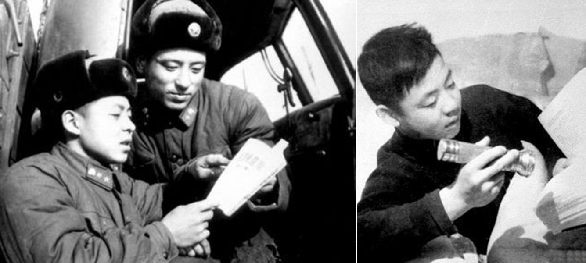

## Chairman Mao's Good Reader: Mise en abyme in *The Diary of Lei Feng*

Lei Feng 雷锋 (1940-1962) is commonly known in China as a model soldier.
Ever since Mao Zedong 毛泽东 (1893-1976), in his own calligraphy, called
upon the country to learn from Lei Feng in 1963, Lei Feng is a model in
the heroism of the everyday: helping others whenever possible to the
brink of self-abandonment in his wish to "serve the people", being
frugal and perfecting his own ideological and intellectual maturation by
constant studying. His image and his good deeds were chronicled and
restaged in professional photo-shootings during his life time (Tian
2011, Denton 2014: 157-159), they were published (albeit in edited form)
posthumously in *The Diary of Lei Feng*, and then adapted and remediated
into other media, including memorial halls (Denton 2014: 161-167),
movies, *lianhuanhua* and, of course, propaganda posters. To "learn from
Lei Feng" 向雷锋学习 means to mold one's own behavior on that of the
model soldier, to embody his spirit and do good oneself to the point of
self-abandonment and self-sacrifice.

](../assets/images/LeiFengChairmanMaosGoodSoldier.jpg)

In [this](https://chineseposters.net/posters/e39-791) 1963 poster, for example, Lei Feng is presented as "Chairman
Mao's good soldier" 毛主席的好战士. He carries a weapon over his
shoulder and holds a copy of *Mao Zedong's Selected Works* in his arm,
sunflowers representing Mao Zedong looming large in the background. This
not only emphasizes that the cult around Lei Feng was encouraged by Mao.
In addition, the poster illustrates that the cults around Lei Feng and
Mao Zedong were intricately interwoven. Moreover, Lei Feng is armed with
a weapon and Mao's writings, his ideological weapon. This points to the
importance attributed to the written word, its reading and its readers.

In what follows, I argue that reading figures prominently in these two
intermingled cults. The trope of reading is particularly powerful, as it
creates a mise en abyme effect: The reading act represented in the
narrative finds a mirror in the reading act of the diary reader; the
narrative depicts a text which mirrors itself in the text that the
reader of the diary holds in his or her hands. As the reader of the
diary reads about Lei Feng reading, he or she may see himself or herself
mirrored in the reader in the narrative. In their literary policies, the
CCP clearly built on this mechanism, calling on literary authors to
create fictional characters to be emulated by the readers of fiction
(Wagner 1995). Similarly, hagiographic texts and images about models and
martyrs were employed as study materials to provide the population with
guides to their own behavior in similar ways that fictional characters
served as ideological role models. While this ties mise en abyme to the
literary policies of the CCP, the (theoretically) infinite recursion of
the trope or reading turns the mise en abyme effect into a powerful
meta-textual tool to reflect on reading, it becomes a meta-reading act.

The cults of Lei Feng and Mao Zedong are part of PRC textual and media
practices which were embedded within domestic and international politics
of the time, in particular, the Chinese reception of Khrushchev's secret
speech (1956). In it, Khrushchev criticized the cult of the individual
built around Stalin in the Soviet Union. Mao, conversely, was convinced
of the integrative and legitimizing functions of such a cult (Leese
1) and therefore and with the help of Lin Biao 林彪 and the PLA
consciously crafted such a cult around himself and his writings. Despite
the fact that his writings do not amount to a coherent ideology, Mao was
elevated to the status of a theoretician, by means of picking out
individual quotes or texts and through rote learning of his texts, or
quotations thereof (Cook 2014, Leese 2014). In his constant reading of
Mao Zedong, Lei Feng thus contributed to the Mao cult, while turning
into the object of a cult himself. He thus was not only "Chairman Mao's
good soldier", but could also be called "Chairman Mao's good reader"
毛主席的好读者, which is also illustrated by widely circulating
photographs of Lei Feng reading the works of Mao:

](../assets/images/LeiFengReading.png)

](../assets/images/QiaoAnshanReading.png)

These carefully staged photographs build on visual representations of
persons depicted as immersed in the reading of core ideological texts in
China as displayed in popular propaganda since the Yan'an years.
Moreover, these photographs mirror Lei Feng's reading acts to which he
devotes much space in his diary: Hardly a page passes without mentioning
a text read and of how it impacted on him. These reading acts seem to
foreshadow Cultural Revolutionary reading practices when reading acts
([Henningsen 2021](https://readchina.github.io/interventions/What_is.html)) of the *Quotations by
Chairman Mao* throughout the country would become an integral part of
the performance of one's revolutionary conviction (Yang 2014, 2016). In
what follows, I will therefore trace how "Chairman Mao's good reader" is
created through Lei Feng's reading acts in the diary.

What, then, does Lei Feng read? And how? For this analysis, I use a
version published in 1963 by Jiefangjun wenyishe (Lei 1963), which
chronicles the years 1959-1962 and is based -- as the preface says -- on
the excerpts that were published in *People's Daily, People's Liberation
Army Daily, Chinese Youth Daily, China Youth* and a few more excerpts
from the original diary, thus representing not necessarily an authentic
version of the diary, but one that was propagated as authentic shortly
after Lei Feng's death. (In my analysis below, I refer to dates of diary
entries instead of page numbers so that they can also be traced to other
editions of the diary).

As "Chairman Mao's good reader", Lei Feng quotes from Mao's works, he
makes resolutions about what to read, he reads Mao's works and learns
from them. For example, on April 29, 1961, Lei Feng chronicles a meeting
which decided on what and how to read in the near future, including two
essays which would later be propagated among the *lao san pian*
(老三篇): Mao's essay "In memory of Norman Bethune" (纪念白求恩,
21.12.1939) and "Serve the People" (为人民服务, 8.9.1945), both about
exemplary figures who sacrificed their lives for the Chinese
revolutionary cause. Five months later, Lei Feng returns to the Bethune
essay and writes about his reading of the essay, devoting the entire
entry of September 22, 1961 to the text, starting as follows:

> I had read Chairman Mao's essay "In memory of Norman Bethune" before and had been moved to hot tears by its spirit of internationalism and its spirit of communism which educated and inspired me very much.

> 毛主席写的《纪念白求恩》这篇文章，我早已读悉，并未他的国际主义精神和共产主义精神感动得流出了热泪，对我的教育和启发特别之大。(22.9.1961)

Lei Feng points to the spirit of unselfishness and then reports that he
reread the text several times as class preparation learning each time
more from it. Faced with the overwhelming sacrifice of Bethune, Lei Feng
then questions himself: "And me? What have I done for the party, for the
people?" 可是我呢？为党、为人民做了一些什么呢？ stating that his studies
are not sufficient yet, and that his contributions to the cause are too
little. But with effort, he will be able to learn to drive well; he
continues by framing the text within the current struggle against
American Imperialism. Lei Feng ends with the resolution that one should
take Bethune as a model in life and contribute to the communist cause.

This is an exemplary reading act. It is one of the more elaborate
reading acts, sharing characteristics with many others throughout the
diary: First, Lei Feng is reflecting about his reading by writing in his
diary, an intimate form of writing which became public with the
publication of the diary (while earlier PRC diary practices served the
attempt to create new socialist subjectivities, Windscript 2020). *The
Diary of Lei Feng* clearly serves as guide for model behavior. Second,
Lei Feng is taking Bethune as a model for his own life, similar to
countless other models and heroes that inspire him throughout the diary,
such as Zhang Xiuyun 张秀云 (2.11.1959), Fang Zhimin 方志敏 (27.12.1960,
26.10.1961), Wang Ruofei 王若飞 (1.5.1961), Guan Chunman 关春满
(2.5.1962), Bai Xiuli 白秀丽 (8.2.1962), Huang Jiguang 黄继光
(26.10.1961, 5.4.1962), Dong Cuirui 董存瑞 (26.10.1961) and Nie Er 聂耳
(14.11.1960). Third, like the other models, Norman Bethune is heavily
mediated as Lei Feng learns about him through the eulogy (i.e. an
explicitly hagiographic text) written by Mao which sets the basic frame
for interpretation: Bethune is declared a martyr who represents the
spirit of communism and internationalism -- and Mao adds further
authority to Bethune by mentioning their brief encounter as well as the
many letters Bethune wrote to him and the one letter that he, Mao, wrote
to Bethune. Fourth, even as the diary is a clear part of the campaign to
promote Lei Feng as a model, it ultimately reinforces the cult around
Mao Zedong in two ways: through the constant affirmations of Lei Feng
that he wishes to be "Mao's good soldier" and through the texts that Lei
Feng studies which point to Mao as written by Mao and with Mao as a
figure in the text. In this case, Mao is the author of the essay about
Bethune, he chronicles his meeting with the Canadian doctor and he
appears as the authority defining Bethune as martyr.

There are a few references to other authors beside Mao Zedong, but some
of these represent only small detours from Mao: On Oct. 8, 1961, for
example, Lei Feng quotes a memorable poem by Lu Xun 鲁迅 (1881-1936)
that he read in the newspaper, thus bringing the father of modern
Chinese literature into his own narrative, and in the next entry
(12.10.1961) he writes down an unforgettable quote by the great author.
However, the latter likely is a quote by Gorky (1898-1936, with the Lu
Xun reference removed in at least some later editions of the diary) and
the former is the poem by Lu Xun that Mao Zedong uses in the concluding
remarks of his 1942 *Yan'an Talks* which were constantly reprinted in
the major Chinese newspapers, calling upon authors and artists to endure
hardships in order to contribute to the revolutionary cause, taking Lu
Xun as their shining example:

> Stern browed I coolly face the fingers of a thousand men
>
> Head bowed I'm glad to be an ox for little children.
>
>(transl. Bonnie McDougall, in: Mao 1980: 85).

> 横眉冷对千夫指，俯首甘为孺子牛。(8.10.1961)

So, even reading Lu Xun ultimately is a reading of Mao Zedong who acts
as the invisible mediator between the modernist author Lu Xun and
"Chairman Mao's good reader" Lei Feng. Lei Feng shifts the frame of
interpretation. In the *Yan'an Talks*, Mao wants authors and artists to
put their work into the service of the people. Lei Feng concludes the
entry with the resolution:

> Towards the enemy, I will be as merciless as the cold winter; towards the party and the people, I will be loyal and honest, I will forever be loyal to the party, loyal to the people...

> 对敌人要狠，要象严冬一样残酷无情；对党、对人民要忠诚老实，永远忠于党，忠于人民...... (8.10.1961)

Lei Feng's reading of Bethune is more than an intellectual game of
intertextual entanglements; rather, as befits the genre of the diary, it
chronicles how the texts appealed to him emotionally. At the same time,
the reader of the diary learns little about the contents of the texts.
However, given the wide propagation of Mao's text, it can be assumed
that contemporary readers were more than familiar with the texts
mentioned. Lei Feng's reading act thus focuses not on the ideological
content of the essay, but the potential to provoke an intensive
emotional reaction in the reader: and here, as part of the mise en abyme
effect, the reader is not only Lei Feng, but also the reader of Lei
Feng's diary who reads both Lei Feng and, mediated by Lei Feng, Mao
Zedong's essay. The reading act thus offers the readers of Lei Feng's
diary broad opportunities to identify with Lei Feng and to adopt his
reading of the Bethune essay. And it offers readers a script guiding
them into the proper reaction to a reading of "In Memory of Norman
Bethune": Shedding "hot tears" on the occasion thus represents the
proper way of performing one's own revolutionary standpoint upon reading
the text.

Lei Feng is projecting his own aspirations on the hero he is reading
about, creating a mirror effect: Bethune is what Lei Feng wants to be
and see himself like, so the reading act functions like a mise en abyme.
It mirrors the narrative, albeit on an ontologically different level
thus serving as an interpretational device. The fact that all this is
happening in a book that an actual reader is currently holding in his or
her hands, adds another layer drawing the reader further into the
narrative. Moreover, the potentially infinite recursion of the trope
clearly defines the episode as a mise en abyme, and Lei Feng's diary can
be read as a chain of mise en abymes. After all, Lei Feng projects his
own aspirations on a series of heroes -- mediated through texts read or
movies watched -- and on a series of inspirational texts by chairman
Mao.

> After studying volumes 1-4 of the *Selected Works of Mao Zedong*, my deepest impression is that I \[now\] understood how to be a \[good\] person and who to live for... I find that I myself live so that I can make other people have a better life.

> I want to take comrades like Huang Jiguang, Dong Cunrui and Fang Zhimin as role models and be a person who fervently loves the mother country and the people, who forever is loyal to the party and the people's revolutionary undertaking.

> 我学习了《毛泽东选集》一、二、三、四卷以后,感受最深的是,懂得了怎样做人,为谁活着\...\...我觉得自己活着,就是为了使别人过得更美好。

> 我要以黄继光、董存瑞、方志敏等同志为榜样,做一个热爱祖国、热爱人民,永远忠于党、忠于人民革命事业的人。(26.10.1962)

This is another typical reading act with Lei Feng reflecting in
emotional terms about his readings in the diary. It is a reading act
where reading is transformed into writing and thus mediated, summarizing
Lei Feng's insights and the mechanisms of how this narrative mise en
abyme works. Through study, he immersed himself into the works of Mao
Zedong and now understands what it takes to be a good person. This
realization is both cognitive and emotional, since the writings of Mao
appeal to both his intellect, and they move him deeply. He declares that
he wants to lead a selfless life in order to enable others to lead a
better life and pledges loyalty to the country, the people, the party
and the revolution, inspired by three heroes who sacrificed their lives
in the revolutionary struggle. The reference to these heroes is yet
another mise an abyme as it anticipates Lei Feng's own martyr's death of
which the readers of the diary are aware, whereas Lei Feng himself knows
nothing of it, yet consciously and single-mindedly strives to that
ultimate goal. As in the earlier example, the diary mobilizes the names
of the three heroes, drawing on readers' familiarity with what they
stand for without providing further contents.

Lei Feng and Mao Zedong both are narrative constructs of the diary. The
diary defines Lei Feng as the model reader of Mao. The image of Lei
Feng, or, rather, the various versions of Lei Feng which are created
through diary, photographs, posters and further propaganda materials
thus become an element in the nationwide propagation of the Mao cult.
"Chairman Mao" as a construct of the diary consists of (at least) three
elements: Mao as the highest political authority in the country; Mao as
the author of Mao's works which provide answers to all potential
problems; and Mao as a historical person, or, rather, as a phantom of a
flesh-and-blood person. Despite the physical absence of the historical
Mao in the narrative of the diary, he is ubiquitous in the diary:
Throughout the diary, Lei Feng substitutes the person for the works, as
Mao's works provide him with guidance that is ideological, intellectual
and emotional. This feature of the narrative of the diary can be read
from the perspective of socialist realist fiction, then the dominant
form of art: After all, as a narrative trope the appearance of the
highest political authority -- Stalin in the Soviet Union, Mao Zedong in
China -- is a core feature in many socialist realist novels (Clark
2000). When the hero of the story finds himself (heroes are
predominantly male) in a situation of utter distress, this figure might
appear in the plot and solve all problems at hand. Reading Mao's works
provides Lei Feng with this type of guidance. And through his reading
acts, a close bond is created between the distant leader and his good
reader Lei Feng.

This bond is reinforced as Lei Feng wishes very much to meet with the
chairman (aspiring to become like Bethune on yet another level, who also
met with Mao once). While such a meeting never took place among the
historical Mao and the historical Lei Feng, the reader of the diary is
served a proxy meeting, as Mao appears twice in Lei Feng's dreams: once
on February 22, 1961, and a second time on the night before July 1,
1961\. This dream elevates Lei Feng's spirits: After all, this was the
night before the alleged fortieth anniversary of the founding of the
CCP, and so from his dream he sets off on a eulogy on the greatness of
the party and how much he owes to it. Predominantly, however, the
relationship between Mao and Lei Feng is created through reading acts.
Lei Feng portrays himself through these reading acts as a conscientious
and diligent reader of Chairman Mao. Reading Mao is sedulous studying in
order to become a better person and to better contribute to the
wellbeing of the people and the party and thus to further the sake of
the revolution, a prospect from which Lei Feng draws significant joy.
Reading Mao is about becoming "Chairman Mao's good reader". And for the
readers of *The Diary of Lei Feng*, reading about "Chairman Mao's good
reader" and emulating him in one's own reading, studying and striving to
contribute to the revolution can help transform oneself into "Lei Feng's
good reader", and, by narrative mise en abyme, into "Chairman Mao's good
reader" oneself.

## References

- Clark, Katerina. 2000. *The Soviet Novel: History as Ritual*. Bloomington: University of Indiana Press.
- Cook, Alexander C. 2014. "Introduction: The Spiritual Atom Bomb and its Global Fallout." In *Mao's Little Red Book: A Global History*, edited by Alexander C. Cook, 1-22. Cambridge: Cambridge University Press.
- Denton, Kirk A. 2014. *Exhibiting the Past: Historical Memory and the Politics of Museums in Postsocialist China*. Honolulu: University of Hawaii Press.
- Henningsen, Lena. 2021. "What is a Reading Act?" *ReadChina Interventions* 1, <https://readchina.github.io/interventions/What_is.html>, 2021-04-21), last access 2022-03-15.
- Leese, Daniel, 2013. *Mao Cult: Rhetoric and Ritual in China's Cultural Revolution*. Cambridge: Cambridge University Press.
- Leese, Daniel. 2014. "A Single Spark: Origins and Spread of the Little Red Book in China." In *Mao's Little Red Book: A Global History*, edited by Alexander C. Cook, 23-42. Cambridge: Cambridge University Press.
- Lei Feng 雷锋. 1963. *The Diary of Lei Feng, 1959-1962* 雷锋日记 1959-1962. Beijing: Jiefangjun wenyishe.
- Mao Zedong. 1980: *Talks at the Yan\'an Conference on Literature and Art*, edited and translated by Bonnie McDougall. Ann Arbor: Center for Chinese Studies, University of Michigan.
- Tian Xiaofei. 2011. "The Making of a Hero: Lei Feng and Some Issues of Historiography." In *The People\'s Republic of China at 60: An International Assessment,* edited by William C. Kirby, 283-95. Cambridge: Harvard Asia Center.
- Wagner, Rudolf G. 1995: "Life as a Quote from a Foreign Book. Love, Pavel, and Rita." In *Das andere China. Festschrift für Wolfgang Bauer zum 65. Geburtstag,* edited by Helwig Schmidt-Glintzer, 463-476. Wiesbaden: Harrassowitz.
- Windscript, Shan. 2020. "How to Write a Diary in Communist China: Guidebooks in the Crafting of Socialist Subjectivities." *Modern China* 47/ 4, 412--447.
